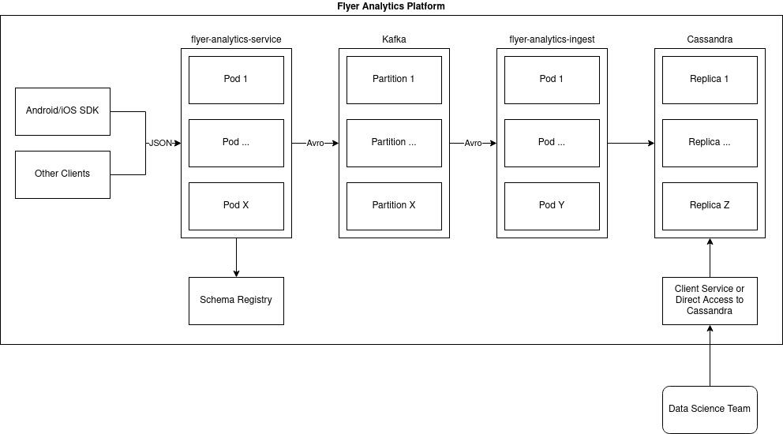

# flyer-analytics

Platform to collect metrics needed for flyer analytics.

## Design

This is the proposed design.



NOTE: `flyer-analytics-service` was renamed to `flyer-analytics-beacon`

For the sake of simplicity, I've decided to exclude the usage of Avro in the demo. The benefits are tangible when 
running production workloads, but is definitely overkill for this usecase, so I've opted for the simpler solution. 
Kafka will process JSON strings, and the end result will be the same. 

## Requirements
The only dependency needed to run this project is `docker-compose`.
To run the spark module, you will need to have `Spark` installed, and have `$SPARK_HOME` set.

## How to run
```bash
./docker-compose up -d
```

To test that the service works, you can run 
```bash
curl -X POST localhost:8082/beacon/collect -d '{"user_id": "ABCD", "event_type": "flyer_open", "merchant_id": "1", "flyer_id": "2"}'
```

You can verify that the new event was inserted in Cassandra
```bash
docker exec -it cassandra cqlsh
select * from flyer.events where date='$CURRENT_DATE';
```

To run the spark module which does the view time calculation, you can run the following command
```bash
sbt spark/package && $SPARK_HOME/bin/spark-submit --class "spark.Main" --packages com.datastax.spark:spark-cassandra-connector_2.12:3.0.0 --master local[4] spark/target/scala-2.12/flyer-analytics-spark_2.12-0.1.0-SNAPSHOT.jar
```

## Assumptions / Calculation

I will be making the following assumptions to do the computation of average time spent on a flyer:
* `flyer_id` is unique across all merchants, so we can effectively ignore `merchant_id`.
* When a user opens a flyer, a `flyer_open` event is sent with a non-null `flyer_id`.
* When a user opens an item on a flyer, an `item_open` event is sent with a non-null `flyer_id`.
* When a user closes a flyer, they are sent back to the flyer list screen, and a `list_flyers` event is sent with a null `flyer_id`.
* When a user closes an item on a flyer, no event is sent (item is opened in a pop-up window, and flyer is still open in background).
* When a user closes the app, no event is sent.

With these assumptions, the only meaningful viewtime we can derive from the data is when a user exits a flyer, and is
redirected to the `list_flyers` screen. Periods of inactivity can not be used as the user may view the flyer without opening
any items, or the user may exit out of the app without first leaving the flyer screen. This means that a lot of the data
will be thrown away.